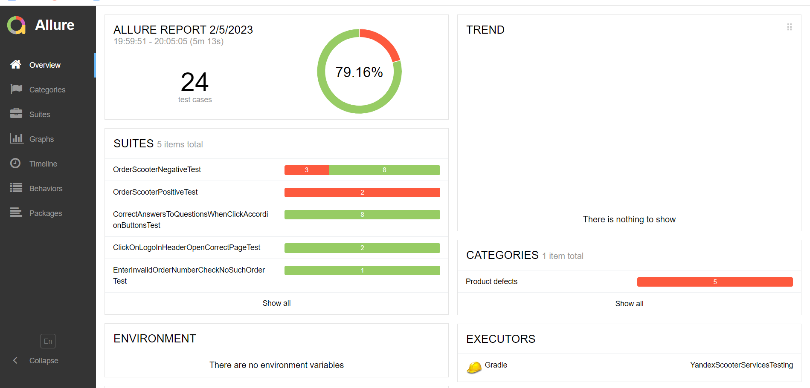
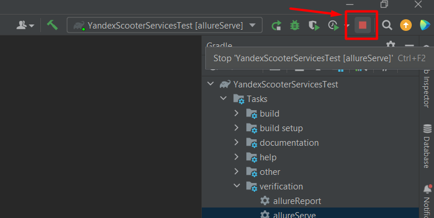

## [QA scooter praktikum services](https://qa-scooter.praktikum-services.ru/) UI testing
****
[QA scooter praktikum services](https://qa-scooter.praktikum-services.ru/) is the web-site for training automation testing.

### Test script
1) Test accordion buttons on the homapage on the chapter "questions about important".
   You need to check: when you click the button on the accordion, the corresponding text opens. Write a separate test for each question.
2) Scooter order. The whole flow of the positive script:
- Click the "Order" button. There are two order buttons on the page;
- Fill in the order form;
- Check that a pop-up window appears with a message about the successful creation of the order.
3) Check if you click on the Scooter logo, you will be taken to the main page of the Scooter.
4) Check if you click on the Yandex logo, the main page of Yandex (Zen) will open in a new window.
5) Check errors for all order form fields.
6) Check if you enter the wrong order number, you will be taken to the order status page. there should be no such order.

### Found the bugs

### Libraries & Tools
> **IntelliJ IDEA**: <em>2022.3.1 - Integrated Development Environment</em> 
> **Gradle**: <em>7.5.1 - Build Tool</em> 
> **Selenide**: <em>6.11.2 - WebDriver</em> 
> **JUnit5 - Jupiter**: <em>5.9.1 - Testing Framework</em> 
> **Allure**: <em>2.20.1 - Test Report</em> 
> **Google chrome**: <em>109.0.5414.120 - Web browser</em> 

### Run Tests and Allure report
On the "Gradle" tab click "test". Then click "allureReport".

After that the folder "build" will be created. Find file "index.html".
>build -> reports -> allure-report -> index.html
> 
Click the right mouse button 
> index.html -> Open In -> Browser -> Chrome

Also you can click to "allureServe" after click "test".

The report will open automatically in the browser.

But after watching the report you need click "stop".

If you want to create a new allure report click "clean" and repeat the steps above.

